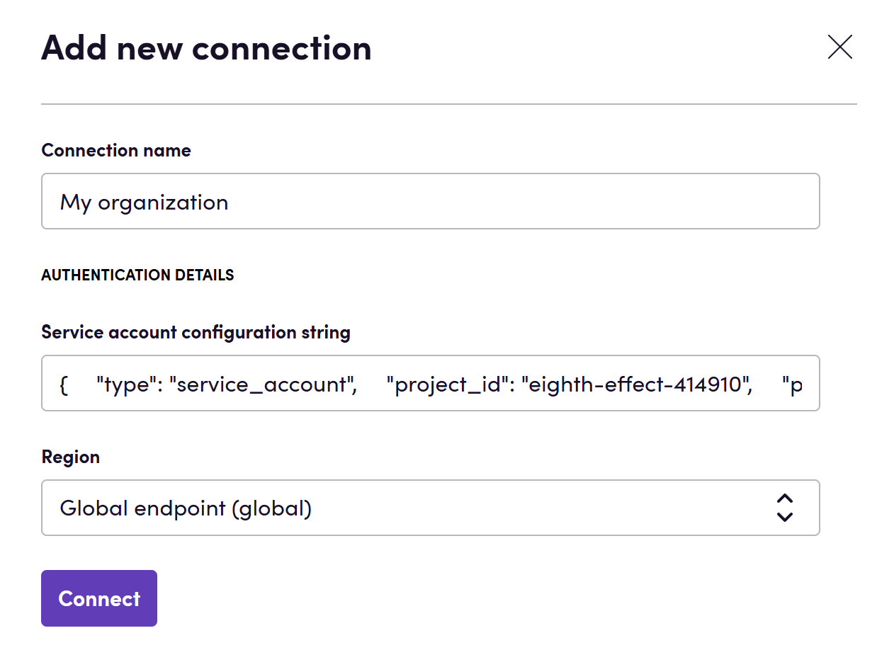

# Blackbird.io Google Vertex AI

Blackbird is the new automation backbone for the language technology industry. Blackbird provides enterprise-scale automation and orchestration with a simple no-code/low-code platform. Blackbird enables ambitious organizations to identify, vet and automate as many processes as possible. Not just localization workflows, but any business and IT process. This repository represents an application that is deployable on Blackbird and usable inside the workflow editor.

## Introduction

<!-- begin docs -->

Vertex AI is a comprehensive platform offering access to powerful multimodal models like Gemini from Google, enabling developers to seamlessly combine various inputs such as text, images, video, or code. With a diverse selection of models, Vertex AI facilitates easy customization and integration, allowing for the development and deployment of AI applications. The platform provides generative AI models, fully managed tools, and purpose-built MLOps solutions to streamline the entire machine learning lifecycle—from training and tuning to deployment and monitoring.

## Before setting up

Before you can connect you need to make sure that:

- You have selected or created a [Cloud Platform project](https://console.cloud.google.com/project).
- You have [enabled billing](https://cloud.google.com/billing/docs/how-to/modify-project) for your project.
- You have [enabled the Vertex AI API](https://console.cloud.google.com/flows/enableapi?apiid=aiplatform.googleapis.com).

## Connecting

1. Navigate to apps and search for Google Vertex AI. If you cannot find Google Vertex AI then click _Add App_ in the top right corner, select Google Vertex AI and add the app to your Blackbird environment.
2. Click _Add Connection_.
3. Name your connection for future reference e.g. 'My organization'.
4. Fill in the project ID of the selected project.
5. Click _Authorize connection_.
6. Follow the instructions that Google gives you, authorizing Blackbird.io to act on your behalf.
7. When you return to Blackbird, confirm that the connection has appeared and the status is _Connected_.

## Actions

- **Generate text with Gemini** generates text using Gemini model. If text generation is based on a single prompt, it's executed with the gemini-1.0-pro model. Optionally, you can specify an image or video to perform generation with the gemini-1.0-pro-vision model. Both image and video have a size limit of 20 MB. If an image is already present, video cannot be specified and vice versa. Supported image formats are PNG and JPEG, while video formats include MOV, MPEG, MP4, MPG, AVI, WMV, MPEGPS, and FLV. Optionally, set _Is Blackbird prompt_ to _True_ to indicate that the prompt given to the action is the result of one of AI Utilities app's actions. You can also specify safety categories in the _Safety categories_ input parameter and respective thresholds for them in the _Thresholds for safety categories_ input parameter. If one list has more items than the other, extra ones are ignored.

## Feedback

Do you want to use this app or do you have feedback on our implementation? Reach out to us using the [established channels](https://www.blackbird.io/) or create an issue.

<!-- end docs -->
